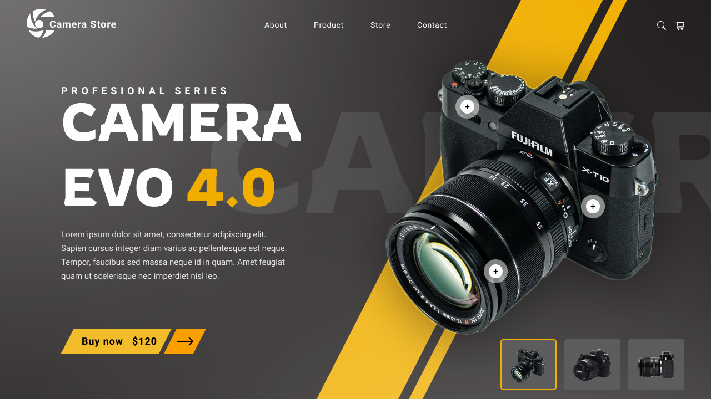

# Camera EVO 4.0

---
## Sobre
Site do tipo landing page para divulgar a camera EVO 4.0
O objetivo deste projeto é colocar em prática os conhecimentos adquiridos no curso do [SENAI Jandira](https://jandira.sp.senai.br/) na criação de web sites.
[Clique aqui](https://cotilen.github.io/desktop-camera/) para acessar o site.
---
## Tecnologias utilizadas 

- HTML
- CSS
- Responsividade

---
## Ferramentas 

- Github
- VScode
- FontAwesome
- Figma
---
## Equipe

- [Cleiton](https://github.com/cotilen)

